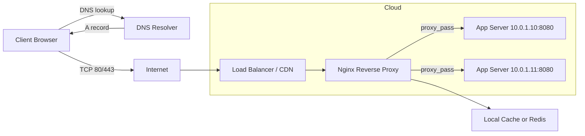
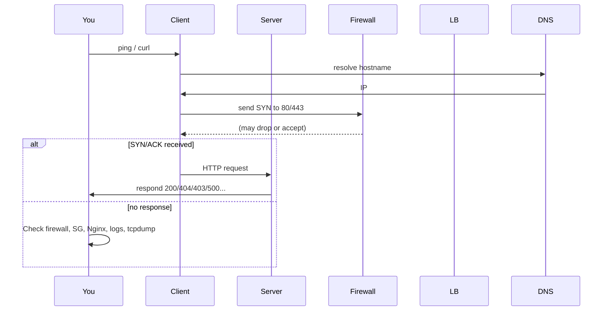
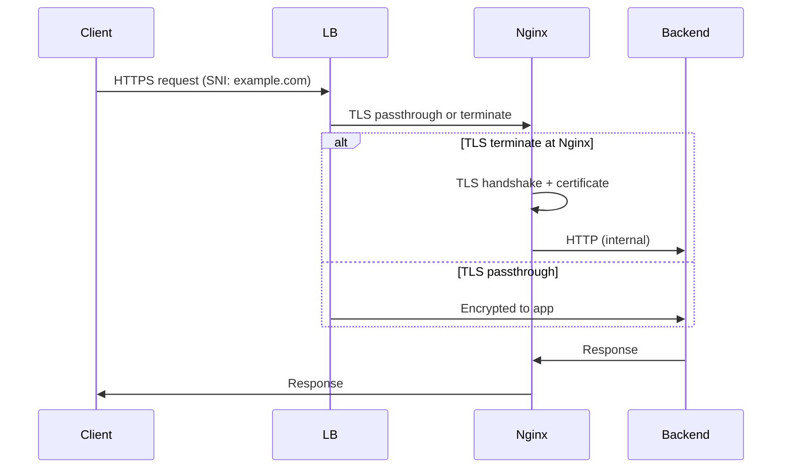

# Nginx — Comprehensive Notes, Troubleshooting, Configs, Diagrams & Scripts

A full, interview-ready Nginx note covering networking troubleshooting (ping/ICMP vs HTTP), DNS, AWS security groups, reverse-proxy, `nmap` / `tcpdump` / Wireshark, Linux network config files, encryption (TLS), and helpful scripts.

---

# Table of contents

1. Quick troubleshooting checklist (high-level)
2. Networking troubleshooting: “IP pings, but browser can’t reach it”
3. Nginx essentials — config examples (nginx.conf, site conf, reverse-proxy, upstreams, SSL)
4. Logs, monitoring & debugging (access/error logs, log_format, status page)
5. `nmap`, `tcpdump`, Wireshark examples and how to interpret results
6. Linux network config files to check and edit (`/etc/*`)
7. Firewall / cloud security (iptables, nftables, ufw, AWS Security Groups, NACLs)
8. TLS / Encryption: best-practices, sample TLS block
9. Useful scripts (bash) and automation ideas
10. Mermaid diagrams: architecture, troubleshooting sequence, request flow
11. Interview talking points — concise bullets you can say

---

# 1 — Quick troubleshooting checklist (short)

When an IP answers to `ping` (ICMP) but the web browser shows no site / times out / connection refused:

1. Check if a web server (Nginx) is listening on ports 80/443: `ss -tunlp | grep -E ':80|:443'`
2. `curl -v http://IP/` and `curl -vk https://IP/` — capture HTTP status codes and TLS errors.
3. Check Nginx access & error logs (usually `/var/log/nginx/access.log`, `/var/log/nginx/error.log`).
4. Check firewall on host (`iptables`, `nft`, `ufw`) and cloud firewall (AWS SGs/NACLs).
5. Check DNS: is hostname resolving to another IP? Use `dig` / `nslookup`.
6. Confirm reverse proxy / load balancer config (could be proxying to an internal IP that's down).
7. Use `nmap -Pn -p 80,443 IP` to see if ports are open or filtered.
8. Capture network packets with `tcpdump` during `curl` to see if SYNs/ACKs are reaching the host.
9. If `nmap` shows no host, try `nmap -sP` or `-PE` ICMP vs `-Pn` (no ping) — host may drop probes.
10. Check SELinux/AppArmor and web root permissions.

---

# 2 — Detailed troubleshooting: “IP pings but browser can't reach site”

### 2.1 Reproduce & gather evidence (commands)

```bash
# Check ICMP:
ping -c 4 203.0.113.10

# HTTP simple check:
curl -I http://203.0.113.10
# or for full:
curl -v http://203.0.113.10/

# HTTPS:
curl -vI https://203.0.113.10 --insecure

# Check if process listening:
ss -tunlp | egrep ':80|:443'   # or 'netstat -tunlp' on older systems

# Check iptables/nft/ufw:
sudo iptables -L -n -v
sudo nft list ruleset
sudo ufw status verbose

# Get DNS:
dig +short example.com
dig +trace example.com

# nmap scan:
sudo nmap -Pn -p 80,443,22 -sS -sV 203.0.113.10

# Capture traffic during request:
sudo tcpdump -i any host 203.0.113.10 and '(port 80 or port 443)' -w /tmp/capture.pcap
# then run curl while capture is on
```

### 2.2 Typical root-causes and how you act

* **Nginx not running / crashed** → `systemctl status nginx` and check `error.log`. Restart if needed (`sudo systemctl restart nginx`).
* **Nginx listening only on loopback (127.0.0.1)** → Check `listen` directives in site config (should be `listen 80;` or `listen 0.0.0.0:80;`).
* **Firewall blocking TCP 80/443** → open ports (`iptables`, `nft`, `ufw`, AWS SGs).
* **Reverse proxy misconfiguration** → proxy_pass target unreachable or upstream health check failing.
* **DNS pointing elsewhere** → `dig` returns different IP than you tested.
* **SSL/TLS errors** → `curl -vk` will reveal cert problems (SNI, wrong cert, expired).
* **Port forwarding / NAT / Load balancer** → load balancer not forwarding or health checks failing.
* **Application upstream crashed** → Nginx returns 502/503 — check upstream.

---

# 3 — Nginx essentials — configs

### 3.1 Minimal `nginx.conf` (production-ready skeleton)

```nginx
# /etc/nginx/nginx.conf
user  nginx;
worker_processes auto;
error_log /var/log/nginx/error.log warn;
pid /var/run/nginx.pid;

events {
    worker_connections 10240;
    multi_accept on;
}

http {
    include       /etc/nginx/mime.types;
    default_type  application/octet-stream;

    log_format  main  '$remote_addr - $remote_user [$time_local] "$request" '
                      '$status $body_bytes_sent "$http_referer" '
                      '"$http_user_agent" "$request_time" "$upstream_response_time"';

    access_log  /var/log/nginx/access.log  main;

    sendfile        on;
    tcp_nopush      on;
    tcp_nodelay     on;
    keepalive_timeout 65;
    types_hash_max_size 2048;
    server_tokens off;  # hide version

    # Gzip
    gzip on;
    gzip_types text/plain text/css application/json application/javascript text/xml application/xml application/xml+rss text/javascript;
    gzip_min_length 1000;

    # SSL settings included from separate file (see below)
    include /etc/nginx/conf.d/*.conf;
    include /etc/nginx/sites-enabled/*;
}
```

### 3.2 Example server block (reverse proxy + caching + health check)

```nginx
# /etc/nginx/sites-available/example.conf
upstream backend {
    server 10.0.1.10:8080 max_fails=3 fail_timeout=10s;
    server 10.0.1.11:8080 max_fails=3 fail_timeout=10s;
    keepalive 16;
}

server {
    listen 80;
    server_name example.com www.example.com;
    return 301 https://$host$request_uri;
}

server {
    listen 443 ssl http2;
    server_name example.com www.example.com;

    ssl_certificate /etc/letsencrypt/live/example.com/fullchain.pem;
    ssl_certificate_key /etc/letsencrypt/live/example.com/privkey.pem;
    include /etc/nginx/snippets/ssl-params.conf;

    # Basic rate limiting:
    limit_req zone=one burst=10 nodelay;

    # Caching for static responses or proxied:
    proxy_cache_path /var/cache/nginx levels=1:2 keys_zone=my_cache:10m max_size=1g inactive=60m use_temp_path=off;

    location / {
        proxy_pass http://backend;
        proxy_set_header Host $host;
        proxy_set_header X-Real-IP $remote_addr;
        proxy_set_header X-Forwarded-For $proxy_add_x_forwarded_for;
        proxy_set_header X-Forwarded-Proto $scheme;

        proxy_connect_timeout 5s;
        proxy_send_timeout 30s;
        proxy_read_timeout 30s;

        proxy_cache my_cache;
        proxy_cache_valid 200 302 10m;
        proxy_cache_valid 404 1m;
    }

    location ~* \.(js|css|png|jpg|jpeg|gif|ico|svg)$ {
        expires 7d;
        add_header Cache-Control "public";
        try_files $uri @fallback;
    }

    location @fallback {
        proxy_pass http://backend;
    }

    # Health check endpoint
    location = /nginx_status {
        stub_status on;
        allow 127.0.0.1; # adjust allowed IPs
        deny all;
    }
}
```

### 3.3 SSL snippet `/etc/nginx/snippets/ssl-params.conf`

```nginx
ssl_protocols TLSv1.2 TLSv1.3;
ssl_prefer_server_ciphers off;
ssl_ciphers 'HIGH:!aNULL:!MD5';
ssl_session_cache shared:SSL:10m;
ssl_session_timeout 10m;
ssl_session_tickets off;
ssl_stapling on;
ssl_stapling_verify on;
resolver 8.8.8.8 8.8.4.4 valid=300s;
resolver_timeout 5s;
add_header Strict-Transport-Security "max-age=31536000; includeSubDomains; preload" always;
```

---

# 4 — Logs, monitoring & debugging

### Important logs

* Nginx: `/var/log/nginx/access.log` and `/var/log/nginx/error.log`
* Upstream app logs (systemd journal or application-specific)
* System logs: `/var/log/syslog` or `journalctl -u nginx`

### Helpful `tail` / `grep` commands

```bash
# Live tail
sudo tail -F /var/log/nginx/error.log /var/log/nginx/access.log

# Show recent 50 errors:
sudo journalctl -u nginx -n 50 --no-pager

# Filter access.log for status codes:
awk '$9 ~ /^5/ {print $0}' /var/log/nginx/access.log | tail -n 50
```

### Nginx debug logs

Enable debug by setting `error_log /var/log/nginx/error.log debug;` in `nginx.conf` — careful: very verbose.

---

# 5 — `nmap`, `tcpdump`, Wireshark — examples & interpretation

### 5.1 `nmap` examples

```bash
# Quick port check (no ping)
sudo nmap -Pn -p 80,443 203.0.113.10

# Service/version detection (careful on prod)
sudo nmap -Pn -sV -p 80,443 203.0.113.10

# Full aggressive scan (do only with permission)
sudo nmap -A 203.0.113.10

# Ping discovery vs no ping:
nmap -sP 203.0.113.0/24           # ARP / ping sweep
nmap -Pn 203.0.113.10            # skip host discovery
```

**Interpretation**:

* `open` → TCP port is open and a service is listening.
* `filtered` → firewall dropped probes (no response).
* `closed` → host reachable but nothing listening on that port.
* `host seems down` but `ping` works → `nmap` may be trying different probe types; use `-Pn` to force.

### 5.2 `tcpdump` examples

```bash
# Capture traffic to/from IP on port 80 or 443, show on console:
sudo tcpdump -i any host 203.0.113.10 and '(port 80 or port 443)' -vv

# Save to pcap:
sudo tcpdump -i eth0 host 203.0.113.10 and '(port 80 or port 443)' -w /tmp/http_traffic.pcap

# Filter only SYN packets (incoming):
sudo tcpdump -i any 'tcp[tcpflags] & (tcp-syn) != 0 and dst host 203.0.113.10 and dst port 80'
```

**What to look for**:

* SYN from client —> SYN/ACK from server —> ACK: TCP handshake completes.
* If SYN seen but no SYN/ACK → server not responding or firewall dropping outbound/inbound.
* If SYN/ACK seen but client RST → client refusing connection (rare for browser).
* For TLS: look for `ClientHello`/`ServerHello` in pcap.

### 5.3 Wireshark tips

* Open the `.pcap` in Wireshark.
* Use filters: `ip.addr == 203.0.113.10 && tcp.port == 443`
* Look for TLS handshake errors (Certificate Unknown, handshake_failure).
* Follow TCP stream to inspect raw HTTP traffic.

---

# 6 — Linux network config files to check/change

Depending on distro:

### Debian/Ubuntu (older)

* `/etc/network/interfaces` — legacy interface config.

### Ubuntu (modern) — Netplan

* `/etc/netplan/*.yaml` — apply with `sudo netplan apply`.

Example netplan:

```yaml
network:
  version: 2
  ethernets:
    eth0:
      dhcp4: false
      addresses: [203.0.113.10/24]
      gateway4: 203.0.113.1
      nameservers:
        addresses: [8.8.8.8,8.8.4.4]
```

### RHEL / CentOS / Fedora

* NetworkManager config or `/etc/sysconfig/network-scripts/ifcfg-eth0`.

### Common files

* `/etc/hosts` — local overrides
* `/etc/resolv.conf` — DNS resolvers (managed by systemd-resolved sometimes)
* `/etc/sysctl.conf` — kernel networking params (e.g., `net.ipv4.ip_forward`)

### Useful commands

```bash
ip addr show
ip route show
cat /etc/resolv.conf
systemctl status NetworkManager
```

---

# 7 — Firewalls & Cloud (AWS) — what to check

### 7.1 Host firewall

* **iptables**

```bash
sudo iptables -L -n -v    # list
sudo iptables -I INPUT -p tcp --dport 80 -j ACCEPT
```

* **nftables**

```bash
sudo nft list ruleset
```

* **ufw**

```bash
sudo ufw status verbose
sudo ufw allow 80/tcp
sudo ufw allow 443/tcp
```

### 7.2 AWS-level checks

* **Security Groups** — stateful; must allow inbound 80/443 from allowed sources and outbound responses allowed usually by default.

  * Check with AWS Console or:

```bash
aws ec2 describe-security-groups --group-ids sg-xxxxxxxx
```

* **Network ACLs (NACLs)** — stateless; ensure both inbound and outbound rules allow return traffic.
* **Load Balancer** — check target group health checks; if unhealthy, LB returns 503.
* **VPC route tables** — ensure subnet has route to internet gateway for public instances; NAT for private subnets.

**Interview note**: mention you check both host firewall and cloud security groups, because it's common to find SG denying 0.0.0.0/0 or a NACL blocking ephemeral ports.

---

# 8 — TLS / Encryption — basics & sample config

### Best-practices (short)

* Use TLS1.2+ and prefer TLS1.3.
* Use strong ciphers; disable old weak ciphers and protocols (SSLv3, TLS1.0/1.1).
* Use HSTS header for production: `Strict-Transport-Security`.
* Enable OCSP stapling (`ssl_stapling on;`).
* Renew certificates automatically (certbot, acme clients).

### Example: SSL server block (excerpt)

```nginx
listen 443 ssl http2;
ssl_certificate /etc/letsencrypt/live/example.com/fullchain.pem;
ssl_certificate_key /etc/letsencrypt/live/example.com/privkey.pem;
ssl_protocols TLSv1.2 TLSv1.3;
ssl_prefer_server_ciphers off;
ssl_ciphers 'ECDHE-ECDSA-AES256-GCM-SHA384:ECDHE-RSA-AES256-GCM-SHA384';
ssl_session_cache shared:SSL:10m;
ssl_session_tickets off;
ssl_stapling on;
ssl_stapling_verify on;
add_header Strict-Transport-Security "max-age=63072000; includeSubDomains; preload" always;
```

---

# 9 — Useful scripts (bash) — quick health checks & automation

### 9.1 Simple HTTP status checker (bash)

```bash
#!/usr/bin/env bash
# http_check.sh <URL>
URL="$1"
if [ -z "$URL" ]; then
  echo "Usage: $0 http://example.com"
  exit 2
fi

code=$(curl -s -o /dev/null -w "%{http_code}" --max-time 10 "$URL")
echo "$(date -Iseconds) $URL -> $code"
case "$code" in
  200) echo "OK";;
  301|302) echo "Redirect";;
  403) echo "Forbidden (maybe firewall or app)";;
  404) echo "Not Found (check virtual host)";;
  502|503|504) echo "Upstream problem or service down";;
  *) echo "Other: $code";;
esac
```

### 9.2 Full automated troubleshooting script (starter)

This does lightweight checks and is safe for interview demonstration. (Don't run aggressive `nmap` on infra you don't own.)

```bash
#!/usr/bin/env bash
IP="$1"
HOSTNAME="$2"

if [ -z "$IP" ]; then
  echo "Usage: $0 <IP> [hostname]"
  exit 1
fi

echo "Ping test:"
ping -c 3 $IP || true

echo -e "\nCheck ports 80/443 (nmap -Pn):"
sudo nmap -Pn -p 22,80,443 "$IP"

echo -e "\nTry curl http and https:"
curl -I --max-time 5 "http://$IP" || true
curl -I -k --max-time 5 "https://$IP" || true

echo -e "\nHost listening (ss):"
ssh_cmd="ss -tunlp | grep -E ':80|:443' || true"
echo "Run on host: $ssh_cmd"

echo -e "\nIf ports closed, check firewall & cloud rules."
```

---

# 10 — Mermaid diagrams

### 10.1 Architecture (flowchart)



### 10.2 Troubleshooting sequence diagram



### 10.3 Request flow (sequence)



---

# 11 — Interview-ready bullets (short statements)

* “If an IP responds to ICMP (ping) but a browser can’t connect, I first check whether a web server is listening (`ss -tunlp`). If listening, I `curl` the IP to get an HTTP status — that immediately tells whether it's a 200, 301, 403, 404, 5xx, etc.”
* “403 often indicates an application or web server access rule or file permissions; 404 means Nginx config may not have the right server_name or root; 5xx implies upstream failures, which I check by viewing Nginx error logs and upstream app logs.”
* “I check host firewall (`iptables`/`nft`/`ufw`) and cloud-level rules (AWS Security Groups and NACLs) because both can block TCP while ICMP may pass.”
* “If `nmap` doesn’t discover expected ports, I use `nmap -Pn` (skip ping) and `tcpdump` to verify whether SYNs reach the host and whether SYN/ACKs are returned.”
* “I’ll inspect Nginx server blocks for `listen` directives (ensure 0.0.0.0:80/443), `proxy_pass` targets (ensure target IP/port reachable), and SSL settings (SNI mismatch causes cert errors).”
* “For encryption: prefer TLS1.3, disable old ciphers, enable HSTS and OCSP stapling, and automate cert renewals via ACME (certbot).”
* “I script routine checks — `curl` HTTP status, `ss`/`ss -tunlp`, `tail -F` logs, and a packet capture (`tcpdump`) during the failing request. That workflow helps triage quickly.”

---

# Additional examples & notes

### Example: Diagnosing when `nmap` shows filtered but ping works

* If ping succeeds but TCP is `filtered`, likely a **stateful firewall** is configured to allow ICMP but drop TCP or rate-limit port scans. Use `tcpdump` on the host to confirm if packets arrive. If packets arrive but no process replies, check local firewall (iptables/nft/ufw) or `iptables -t raw` rules or `conntrack` entries.

### Example: Reverse-proxy mis-route

* Nginx `server_name` mismatch: Nginx chooses the default `server` block for the incoming `Host` — this may serve a default page or 404. Solution: make sure server_name matches or add `server_name _;` fallback.

### Health check issues behind LB

* If ALB/ELB health checks are returning unhealthy but direct IP `curl` returns 200, check that health check path, port, and security groups permit ALB to reach target. Also check target group protocol (HTTP vs HTTPS) mismatch.

---

# Files & copy-paste checklist

* `/etc/nginx/nginx.conf` — use skeleton above
* `/etc/nginx/sites-available/example.conf` — site block above
* `/etc/nginx/snippets/ssl-params.conf` — TLS settings above
* Script files: `http_check.sh`, `diag_quick.sh` from the script section

---