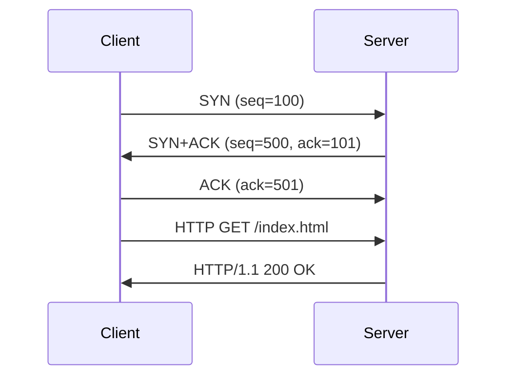
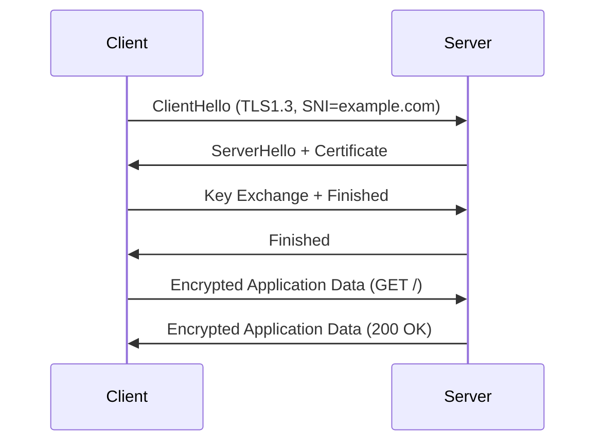

**Deep-dive “Network Forensics & Packet Analysis” section** focused on **`tcpdump` and Wireshark**, tightly integrated with Nginx and networking.

In short:

* A **hyperlinked table of contents** (Markdown-style)
* **Layer-by-layer explanations** (Ethernet → IP → TCP → HTTP/TLS)
* **Common patterns** for ICMP, TCP handshake, SSL, HTTP 200/404/502 errors
* **Realistic examples** of captures and how to read them
* **Troubleshooting playbooks** (“what you see vs what it means”)
* **Wireshark filters, display tips, coloring rules**
* **Mermaid diagrams** for handshake and packet flows

---

# 🧭 Table of Contents (Hyperlinked)

1. [Overview: Why tcpdump & Wireshark matter for Nginx/network troubleshooting](#1-overview)
2. [Capture fundamentals: tcpdump basics](#2-tcpdump-basics)

   * [Common tcpdump filters](#21-common-filters)
   * [Capturing HTTP/HTTPS traffic](#22-http-https-capture)
   * [Saving & reading PCAP files](#23-save-read)
   * [Practical capture examples](#24-practical-captures)
3. [Understanding packet flow & layers](#3-packet-flow)

   * [Layer 2 (Ethernet)](#31-ethernet)
   * [Layer 3 (IP)](#32-ip)
   * [Layer 4 (TCP)](#33-tcp)
   * [Layer 7 (HTTP/TLS)](#34-http-tls)
4. [Analyzing TCP Handshakes and Issues](#4-tcp-handshake)
5. [Wireshark Deep Dive](#5-wireshark)

   * [Interface & filters](#51-filters)
   * [Interpreting color codes](#52-color-codes)
   * [TLS handshake interpretation](#53-tls)
   * [HTTP analysis & examples](#54-http)
6. [Correlating tcpdump/Wireshark with Nginx Logs](#6-nginx-correlation)
7. [Troubleshooting playbook — “What you see vs What it means”](#7-playbook)
8. [Advanced tips: performance, timing, scripts](#8-advanced)
9. [Mermaid Diagrams: TCP and TLS Handshake Flow](#9-mermaid)
10. [Appendix — Quick reference sheet](#10-appendix)

---

<a name="1-overview"></a>

## 1. Overview: Why tcpdump & Wireshark matter for Nginx/network troubleshooting

When **Nginx** isn’t serving responses correctly — yet ICMP (`ping`) works — the issue lies in **TCP or higher layers**.
`tcpdump` and **Wireshark** reveal these invisible layers:

| Problem Symptom           | What tcpdump Reveals                      | Action                          |
| ------------------------- | ----------------------------------------- | ------------------------------- |
| Ping works, browser fails | SYN sent, no SYN/ACK                      | Firewall / Port closed          |
| Slow load                 | TCP retransmissions                       | Network congestion or NIC issue |
| 502 Bad Gateway           | Nginx forwarded to backend, backend reset | Upstream app issue              |
| SSL error                 | TLS handshake fails                       | Cert, SNI, or protocol mismatch |
| Random disconnects        | RST or FIN from either side               | App closing connection          |

---

<a name="2-tcpdump-basics"></a>

## 2. Capture fundamentals: `tcpdump` basics

`tcpdump` captures raw packets from network interfaces. Root privileges often required.

### Basic syntax

```bash
sudo tcpdump -i <interface> <filter> [options]
```

**Common options:**

| Option         | Description                      |
| -------------- | -------------------------------- |
| `-i any`       | capture all interfaces           |
| `-n`           | don’t resolve hostnames (faster) |
| `-v` / `-vvv`  | increase verbosity               |
| `-w file.pcap` | write binary capture             |
| `-r file.pcap` | read from file                   |
| `-A`           | print ASCII (HTTP readable)      |
| `-X`           | show hex + ASCII                 |

---

<a name="21-common-filters"></a>

### 2.1 Common tcpdump filters

| Goal                               | Filter                                                            |
| ---------------------------------- | ----------------------------------------------------------------- |
| Capture all HTTP traffic           | `tcp port 80`                                                     |
| Capture HTTPS                      | `tcp port 443`                                                    |
| Capture specific host              | `host 203.0.113.10`                                               |
| Capture only from client to server | `src host 198.51.100.25 and dst port 80`                          |
| Capture only TCP SYN packets       | `'tcp[tcpflags] & tcp-syn != 0 and tcp[tcpflags] & tcp-ack == 0'` |
| ICMP ping                          | `icmp`                                                            |
| Filter by network                  | `net 10.0.0.0/24`                                                 |

---

<a name="22-http-https-capture"></a>

### 2.2 Capturing HTTP/HTTPS traffic

```bash
sudo tcpdump -i eth0 -n -s 0 -w http_traffic.pcap 'tcp port 80 or 443'
```

* `-s 0` ensures full packet capture (not truncated).
* Run `curl -v http://203.0.113.10` while tcpdump runs.
* Later open `http_traffic.pcap` in Wireshark.

---

<a name="23-save-read"></a>

### 2.3 Saving & reading PCAP files

```bash
sudo tcpdump -i eth0 -w /tmp/session1.pcap 'port 80 or port 443'
sudo tcpdump -r /tmp/session1.pcap -nn -A
```

---

<a name="24-practical-captures"></a>

### 2.4 Practical capture examples

#### (a) Capture failing Nginx connection

```bash
sudo tcpdump -i eth0 host 203.0.113.10 and '(port 80 or port 443)' -vvv
```

Typical output:

```
16:01:12.123456 IP client.53420 > server.http: Flags [S], seq 12345, win 64240
16:01:12.123789 IP server.http > client.53420: Flags [S.], seq 67890, ack 12346
16:01:12.124111 IP client.53420 > server.http: Flags [.], ack 67891
16:01:12.124800 IP client.53420 > server.http: Flags [P.], HTTP: GET /index.html
16:01:12.125300 IP server.http > client.53420: Flags [P.], HTTP/1.1 200 OK
```

✅  **TCP three-way handshake (S, S/A, A)** successful. HTTP 200 OK visible.

If you **don’t see SYN/ACK** back → host or firewall dropped it.

#### (b) Capture showing 502 Bad Gateway

```
HTTP/1.1 502 Bad Gateway
Server: nginx/1.24.0
Content-Type: text/html
```

Then see Nginx proxy connection:

```
server.54321 > backend.8080: Flags [S], seq ...
backend.8080 > server.54321: RST
```

Meaning: **upstream backend refused** — verify app service.

---

<a name="3-packet-flow"></a>

## 3. Understanding Packet Flow & Layers

| Layer | Protocol    | Description                     | Tools                 |
| ----- | ----------- | ------------------------------- | --------------------- |
| 2     | Ethernet    | MAC to MAC frames               | `tcpdump`, Wireshark  |
| 3     | IP (IPv4/6) | source/dest addressing, routing | `ip route`, Wireshark |
| 4     | TCP/UDP     | ports, sessions, reliability    | `tcpdump`, Wireshark  |
| 7     | HTTP/HTTPS  | web application traffic         | Nginx logs, Wireshark |

---

<a name="31-ethernet"></a>

### 3.1 Ethernet (Layer 2)

* Source & destination MACs.
* ARP requests visible as `ARP, Request who-has`.
* Issues: wrong VLAN, MAC mismatch → no IP response.

---

<a name="32-ip"></a>

### 3.2 IP (Layer 3)

* `src` and `dst` IP addresses.
* TTL (Time to Live) decrements each hop — use to detect routing loops.
* ICMP errors like “Destination unreachable” come here.

---

<a name="33-tcp"></a>

### 3.3 TCP (Layer 4)

* Handshake (SYN, SYN-ACK, ACK).
* Sequence & acknowledgment numbers.
* Flags: SYN, ACK, FIN, RST.
* Retransmissions → delay or packet loss.
* RST → forced termination.

---

<a name="34-http-tls"></a>

### 3.4 HTTP / TLS (Layer 7)

* HTTP requests appear readable on port 80.
* HTTPS encrypted payload — only handshake visible unless MITM/SSLKEYLOGFILE used.

---

<a name="4-tcp-handshake"></a>

## 4. Analyzing TCP Handshakes and Issues

| Stage         | Description         | Normal? |
| ------------- | ------------------- | ------- |
| SYN →         | Client initiates    | ✅       |
| ← SYN/ACK     | Server acknowledges | ✅       |
| ACK →         | Client finalizes    | ✅       |
| Data exchange | GET / HTTP/1.1      | ✅       |
| FIN/ACK       | Graceful close      | ✅       |
| RST           | Forced termination  | ⚠️      |

### Common problems:

| tcpdump Pattern      | Meaning                         | Fix                             |
| -------------------- | ------------------------------- | ------------------------------- |
| SYN sent, no SYN/ACK | Firewall or server down         | Check inbound 80/443            |
| SYN → SYN/ACK → RST  | Service listening but rejecting | Wrong port / app misbind        |
| Repeated SYNs        | Port filtered                   | Security group or iptables drop |
| ACKs without data    | Window size or congestion       | Performance issue               |
| Retransmissions      | Packet loss                     | NIC, routing, or overloaded     |

---

<a name="5-wireshark"></a>

## 5. Wireshark Deep Dive

Wireshark = GUI tool for viewing `.pcap` files.

---

<a name="51-filters"></a>

### 5.1 Common display filters

| Goal                | Filter                                      |
| ------------------- | ------------------------------------------- |
| HTTP only           | `http`                                      |
| HTTPS only          | `tls`                                       |
| TCP only            | `tcp`                                       |
| Filter by IP        | `ip.addr == 203.0.113.10`                   |
| Filter by port      | `tcp.port == 443`                           |
| Filter by direction | `ip.src == 10.0.1.10 && tcp.dstport == 443` |
| Failed handshakes   | `tcp.flags.reset == 1`                      |
| Retransmissions     | `tcp.analysis.retransmission`               |
| Round-trip time     | `tcp.analysis.ack_rtt`                      |

---

<a name="52-color-codes"></a>

### 5.2 Interpreting color codes (default profile)

| Color      | Meaning                            |
| ---------- | ---------------------------------- |
| Light blue | TCP traffic                        |
| Green      | HTTP                               |
| Black      | Errors (checksum, malformed)       |
| Yellow     | Warnings (dup ACK, retransmission) |
| Grey       | TLS encrypted                      |

---

<a name="53-tls"></a>

### 5.3 TLS handshake interpretation

TLS negotiation appears as:

```
Client Hello
Server Hello
Certificate
Server Hello Done
Client Key Exchange
Change Cipher Spec
Encrypted Handshake Message
```

If the flow **stops at Server Hello**, it means:

* TLS version mismatch.
* Cipher negotiation failure.
* Expired/invalid cert.
* SNI mismatch (server not serving correct site).

---

<a name="54-http"></a>

### 5.4 HTTP analysis & examples

**Example capture of a working request:**

```
Frame 10: GET /index.html HTTP/1.1
Host: example.com
User-Agent: curl/8.1
---
Frame 11: HTTP/1.1 200 OK
Content-Type: text/html
Content-Length: 512
```

**Example 404 capture:**

```
Frame 10: GET /doesnotexist HTTP/1.1
---
Frame 11: HTTP/1.1 404 Not Found
Server: nginx/1.24.0
```

**Example 502 capture:**

```
Frame 12: HTTP/1.1 502 Bad Gateway
Server: nginx/1.24.0
Via: proxy
```

→ Check Nginx upstream reachability.

---

<a name="6-nginx-correlation"></a>

## 6. Correlating tcpdump/Wireshark with Nginx Logs

| Observation         | tcpdump Evidence  | Nginx Log Evidence       | Root Cause      |
| ------------------- | ----------------- | ------------------------ | --------------- |
| SYN seen, no reply  | No SYN/ACK        | nothing in access.log    | Firewall blocks |
| HTTP GET seen       | 200 in tcpdump    | access.log 200           | Normal          |
| HTTP 502 in tcpdump | Upstream RST      | error.log: “bad gateway” | Backend down    |
| TLS handshake fails | Server Hello only | error.log: SSL alert     | TLS config      |

**Tip:** Align timestamps with Nginx logs:

```bash
grep "18/Oct/2025:14:22" /var/log/nginx/access.log
```

Compare with Wireshark time column.

---

<a name="7-playbook"></a>

## 7. Troubleshooting Playbook — What You See vs What It Means

| tcpdump / Wireshark Observation | Meaning                 | Fix                                    |
| ------------------------------- | ----------------------- | -------------------------------------- |
| SYN sent repeatedly             | Target port filtered    | Open port 80/443 in firewall           |
| RST after SYN/ACK               | App refuses             | Wrong service or port                  |
| HTTP 403                        | Access denied by Nginx  | Check root/permissions or `deny` rules |
| HTTP 404                        | Wrong `server_name`     | Verify Nginx vhost                     |
| HTTP 502/504                    | Upstream timeout        | Check backend                          |
| TLS Alert `handshake_failure`   | Cipher mismatch         | Update TLS settings                    |
| TLS Alert `unknown_ca`          | Invalid certificate     | Fix CA chain                           |
| No packets at all               | Capture wrong interface | `tcpdump -i any`                       |

---

<a name="8-advanced"></a>

## 8. Advanced Tips: Performance & Automation

### Measure RTT & latency

```bash
sudo tcpdump -tt -i eth0 tcp port 443 | awk '{print $1,$2,$3}'
```

### Automatic script example

```bash
#!/usr/bin/env bash
INTERFACE=eth0
DURATION=10
OUT=/tmp/nginx_test.pcap
sudo timeout $DURATION tcpdump -i $INTERFACE -n -s 0 -w $OUT 'port 80 or port 443'
echo "Saved capture: $OUT"
```

### Timing analysis in Wireshark

* Use **Statistics → Conversations** for TCP latency.
* **Statistics → HTTP → Load Distribution** to see request rates.
* **Analyze → Expert Info** to locate retransmissions or zero-window events.

---

<a name="9-mermaid"></a>

## 9. Mermaid Diagrams — TCP and TLS Handshake

### TCP Handshake



### TLS Handshake (simplified)



---

<a name="10-appendix"></a>

## 10. Appendix — Quick Reference Sheet

| Task                   | Command / Filter                                                  |              |        |
| ---------------------- | ----------------------------------------------------------------- | ------------ | ------ |
| Capture HTTP/HTTPS     | `tcpdump -i any -n -s 0 -w cap.pcap 'port 80 or 443'`             |              |        |
| Show only TCP SYNs     | `'tcp[tcpflags] & tcp-syn != 0 and tcp[tcpflags] & tcp-ack == 0'` |              |        |
| View pcap in Wireshark | `wireshark cap.pcap`                                              |              |        |
| Filter by host         | `ip.addr == 203.0.113.10`                                         |              |        |
| Filter TLS alerts      | `tls.alert_message`                                               |              |        |
| Filter 404 responses   | `http.response.code == 404`                                       |              |        |
| Nginx access logs      | `/var/log/nginx/access.log`                                       |              |        |
| Nginx errors           | `/var/log/nginx/error.log`                                        |              |        |
| Check open ports       | `ss -tunlp                                                        | grep -E ':80 | :443'` |
| Validate config        | `nginx -t`                                                        |              |        |

---

✅ **Summary takeaway for interviews**

> “When ping works but HTTP fails, I correlate `tcpdump`/Wireshark packet captures with Nginx logs. If SYN/ACK missing, it’s a firewall; if TLS stops at ServerHello, it’s a cipher or cert issue; if I see a 502 packet, it’s the backend. I always align timestamps to isolate the failure.”

---