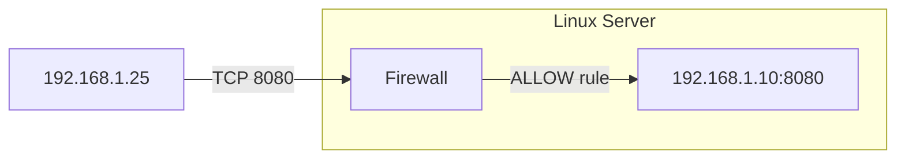

# “How do you allow another computer (say `192.168.1.25`) to access a specific port (say `8080`) on a Linux server through the firewall?”

Below I’ll show **all the main methods** — `ufw`, `iptables`, `firewalld`, and `nftables` — depending on which firewall your Linux uses.
We’ll also cover **AWS security groups (if it’s cloud)** and how to **verify** the rule works.

---

## 🧩 Scenario

* Your Linux server’s IP: `192.168.1.10`
* You want your second computer (`192.168.1.25`) to access **port 8080/tcp** (e.g., a web portal running on Nginx, Tomcat, etc.)

---

# 1️⃣ Check which firewall you have

```bash
sudo systemctl status ufw
sudo systemctl status firewalld
sudo which nft
sudo which iptables
```

Whichever is **active/enabled**, use that method below.

---

# 2️⃣ Using **UFW** (Ubuntu / Debian simple firewall)

```bash
# Allow port 8080 for all
sudo ufw allow 8080/tcp

# Allow port 8080 only for one IP
sudo ufw allow from 192.168.1.25 to any port 8080 proto tcp

# Check rules
sudo ufw status verbose

# Reload firewall (if needed)
sudo ufw reload
```

🧠 **Example output:**

```
To                         Action      From
--                         ------      ----
8080/tcp                   ALLOW       192.168.1.25
```

---

# 3️⃣ Using **firewalld** (RHEL / CentOS / Fedora)

```bash
# Check zone
sudo firewall-cmd --get-active-zones

# Allow 8080 for all in "public" zone
sudo firewall-cmd --permanent --zone=public --add-port=8080/tcp

# Or restrict to one IP
sudo firewall-cmd --permanent --zone=public --add-rich-rule='rule family="ipv4" source address="192.168.1.25" port port="8080" protocol="tcp" accept'

# Reload
sudo firewall-cmd --reload

# Verify
sudo firewall-cmd --list-all
```

✅ **Rich rule** lets you limit source IPs precisely.

---

# 4️⃣ Using **iptables** (legacy but still common)

```bash
# Allow from specific IP to port 8080
sudo iptables -A INPUT -p tcp -s 192.168.1.25 --dport 8080 -j ACCEPT

# (Optional) deny others
sudo iptables -A INPUT -p tcp --dport 8080 -j DROP

# Save rules permanently
sudo sh -c "iptables-save > /etc/iptables/rules.v4"
# Or depending on distro:
sudo service netfilter-persistent save
```

🔍 **Verify**

```bash
sudo iptables -L -n -v | grep 8080
```

---

# 5️⃣ Using **nftables** (modern replacement for iptables)

```bash
# List current tables
sudo nft list ruleset

# Add rule (example, assuming inet filter table)
sudo nft add rule inet filter input ip saddr 192.168.1.25 tcp dport 8080 accept

# Save config
sudo nft list ruleset > /etc/nftables.conf
```

---

# 6️⃣ AWS / Cloud (if instance is on AWS)

Even if your Linux firewall allows the port, **AWS Security Groups** must also permit inbound access.

✅ **AWS CLI example:**

```bash
aws ec2 authorize-security-group-ingress \
  --group-id sg-xxxxxxx \
  --protocol tcp --port 8080 \
  --cidr 192.168.1.25/32
```

Or via AWS Console → EC2 → Security Groups → Inbound Rules → “Add rule” (TCP, port 8080, source IP).

---

# 7️⃣ Test from the other computer

```bash
# From 192.168.1.25
curl -I http://192.168.1.10:8080
# or
nc -vz 192.168.1.10 8080
```

✅ Expected: “Connected” or HTTP status 200/403 (means port reachable)

---

# 8️⃣ Visual (Mermaid diagram)



---

# 9️⃣ Common mistakes

❌ Forgot to open port on AWS Security Group
❌ Service not listening on 0.0.0.0 (only on localhost)
❌ Firewall reloaded but rules not saved
❌ Different zone used in `firewalld`
❌ SELinux blocking the port (`setsebool -P httpd_can_network_connect on`)

---

# 10️⃣ Verification summary

```bash
# On server
sudo ss -tunlp | grep 8080   # service listening?
sudo ufw/firewall-cmd/iptables rules check

# On client
nc -vz 192.168.1.10 8080
```

---

✅ **Interview short answer:**

> “To allow another computer access to a specific portal, I open that TCP port in the Linux firewall for that source IP.
> For example, in Ubuntu: `ufw allow from 192.168.1.25 to any port 8080/tcp`.
> Then I verify with `curl` or `nc`.
> In AWS, I also open the port in the Security Group.
> I confirm Nginx or the app is listening on 0.0.0.0 and not just localhost.”

---
